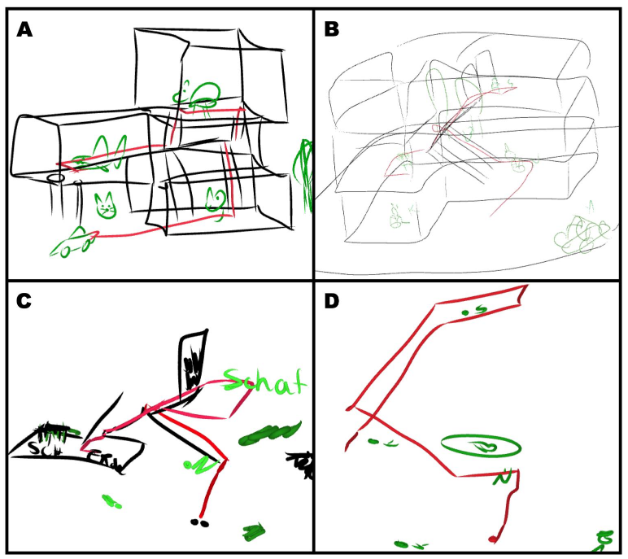

Our new paper is out in the _International Journal of Geographical Information Science_:

[3D environments require 3D visualisations: the limitations of 2D sketch maps in capturing spatial knowledge](https://doi.org/10.1080/13658816.2026.2684650)

An interactive landing page with all data and a summary of results is available [here](https://kubakrukar.github.io/3dsmpaper/).

**What we found:** Participants navigated two types of vertically-complex environments and drew both 2D (pen-and-paper) and 3D (VR) sketch maps. We coded the occurrence and correctness of qualitative spatial relations across all three dimensions.

**Key results:**

- When given 2D pen-and-paper, participants omitted a large amount of (mainly vertical) spatial information that they **did in fact encode** in memory.
- When given a 3D VR sketch mapping tool, they externalised more vertical relations while maintaining comparable correctness.
- The bottleneck is the 2D medium itself, not participants' spatial knowledge. This has methodological implications for navigation research, architectural cognition, and GIS.

A big thank you to all collaborators. This paper is part of the [3D Sketch Maps project](https://data.snf.ch/grants/grant/202284), funded by the Swiss National Science Foundation.
