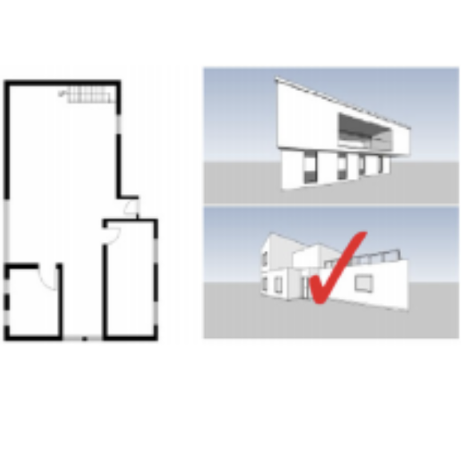

Wayfinding in complex 3D structures such as multi-level buildings, transport hubs, and shopping malls depends on mental representations that current research struggles to capture. Two communities work on this problem largely in parallel. Geoinformatics develops computational and Virtual Reality tools that probe spatial knowledge externally, typically through sketch mapping and related externalisation techniques. Architectural and psychological research, in turn, administers domain-specific psychometric tests to characterise spatial ability internally. The two traditions have rarely been brought into direct contact.

This project joins the two strands. We pair geoinformatics-grounded VR methods developed at SPARC with the psychometric spatial-ability instruments used at the [Human-Centered Interior Environment Lab](https://hielab.weebly.com/faculty.html) led by Prof. Ji Young Cho at Kyung Hee University in Seoul. The central question is whether these measures capture overlapping or complementary aspects of mental representations of 3D space, and how each tradition can be sharpened by drawing on the other.

The collaboration is carried out through mutual research visits of 3–4 weeks (Jakub in Seoul, Ji Young in Münster) over the coming year.

*Funding: German Research Foundation (DFG) and National Research Foundation of Korea (NRF); €20k+*
