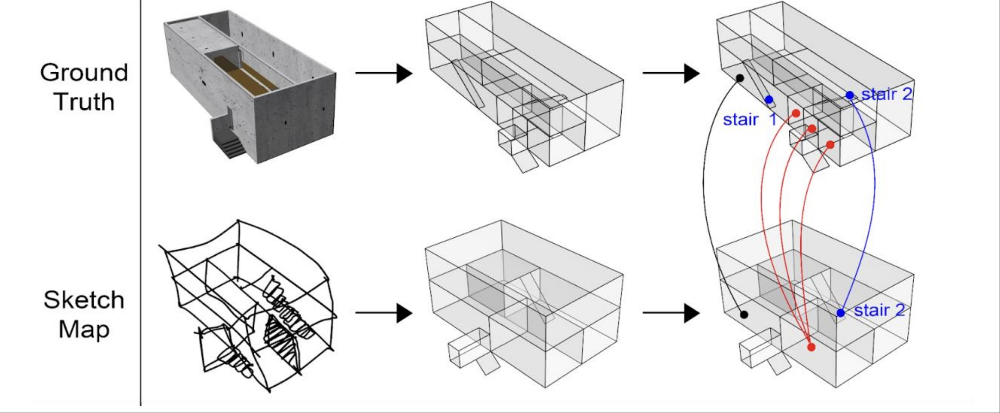

The 3D Sketch Maps project, sponsored by the Swiss National Science Foundation within their Sinergia programme focusing on "interdisciplinary, collaborative and breakthrough research", investigates 3D sketch maps from a theoretical, empirical, cognitive, as well as tool-​related perspective, with a particular focus on Extended Reality (XR) technologies. Sketch mapping is an established research method in fields that study human spatial decision-​making and information processing, such as navigation and wayfinding. Although space is naturally three-​dimensional (3D), contemporary research has focused on assessing individuals’ spatial knowledge with two-​dimensional (2D) sketches. For many domains though, such as aviation or the cognition of complex multilevel buildings, it is essential to study people’s 3D understanding of space, which is not possible with the current 2D methods.

Our role in the project focuses on the problem of analysing 3d sketch maps. These are complicated, messy drawings, that are difficult to interpret. How can we tell if one 3d sketch map is "better" compared to another?

One of our approaches, inspired by the concept of "convex spaces" from the architectural theory of Space Syntax, relies on diving the sketch maps into cuboids, and analysing qualitative relations between them. Our plugin for supporting this analysis within Grasshopper software is available on [github](https://github.com/kubakrukar/3D-Sketch-Map-Analysis).

More details are available on the [Swiss National Science Foundation website](https://data.snf.ch/grants/grant/202284).

### Articles

  * Krukar, J., Aly, A., Baecker, L., Heming, L.M., Zhao, J., & Schwering, A. (2026). 3D environments require 3D visualisations: the limitations of 2D sketch maps in capturing spatial knowledge. *International Journal of Geographical Information Science*. [https://doi.org/10.1080/13658816.2026.2684650](https://doi.org/10.1080/13658816.2026.2684650)
  * Simonet, M., Vater, C., Abati, C., Zhong, S., Mavros, P., Schwering, A., Raubal, M., Hölscher, C., & Krukar, J. (2025). Probing mental representations of space through sketch mapping: a scoping review. *Cognitive Research: Principles and Implications, 10*(1). [https://doi.org/10.1186/s41235-025-00667-w](https://doi.org/10.1186/s41235-025-00667-w)
  * Xiao, T., Chen, Y., Zhong, S., Kiefer, P., Krukar, J., Kim, K.G., Hurni, L., Schwering, A., & Raubal, M. (2025). Sketch2Terrain: AI-driven real-time terrain sketch mapping in augmented reality. In *CHI '25: Proceedings of the 2025 CHI Conference on Human Factors in Computing Systems*. Yokohama, Japan: ACM Press. [https://doi.org/10.1145/3706598.3713467](https://doi.org/10.1145/3706598.3713467)
  * Manivannan, C., Krukar, J., & Schwering, A. (2024). An algorithmic approach to detect generalization in sketch maps from sketch map alignment. *PLOS ONE, 19*. [https://doi.org/10.1371/journal.pone.0304696](https://doi.org/10.1371/journal.pone.0304696)
  * Xiao, T., Kim, K.G., Krukar, J., Subramaniyan, R., Kiefer, P., Schwering, A., & Raubal, M. (2024). VResin: Externalizing spatial memory into 3D sketch maps. *International Journal of Human-Computer Studies, 190*. [https://doi.org/10.1016/j.ijhcs.2024.103322](https://doi.org/10.1016/j.ijhcs.2024.103322)
  * Manivannan, C., Krukar, J., & Schwering, A. (2022). Spatial generalization in sketch maps: A systematic classification. *Journal of Environmental Psychology, 83*. [https://doi.org/10.1016/j.jenvp.2022.101851](https://doi.org/10.1016/j.jenvp.2022.101851)
  * Kim, K.G., Krukar, J., Mavros, P., Zhao, J., Kiefer, P., Schwering, A., Hölscher, C., & Raubal, M. (2022). 3D sketch maps: Concept, potential benefits, and challenges. In *15th International Conference on Spatial Information Theory (COSIT 2022)*, LIPIcs 240. Kyoto: Dagstuhl Publishing. [https://doi.org/10.4230/LIPIcs.COSIT.2022.14](https://doi.org/10.4230/LIPIcs.COSIT.2022.14)
  * Schwering, A., Krukar, J., Manivannan, C., Chipofya, M., & Jan, S. (2022). Generalized, inaccurate, incomplete: How to comprehensively analyze sketch maps beyond their metric correctness. In *15th International Conference on Spatial Information Theory (COSIT 2022)*, LIPIcs 240. Kyoto: Dagstuhl Publishing. [https://doi.org/10.4230/LIPIcs.COSIT.2022.8](https://doi.org/10.4230/LIPIcs.COSIT.2022.8)
