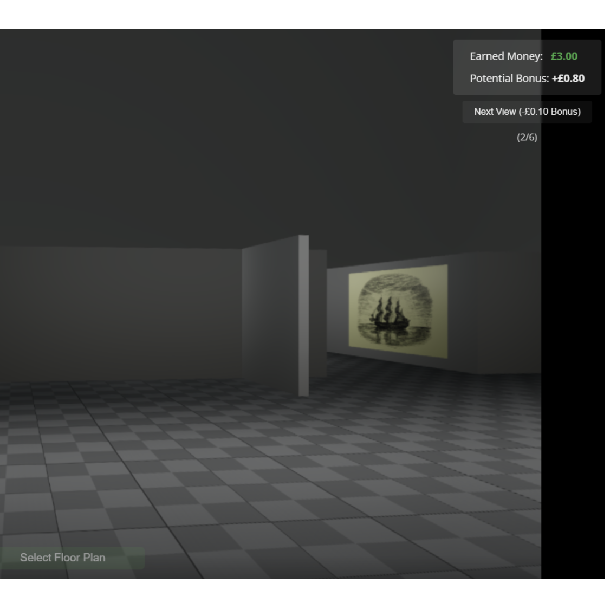

Large public buildings such as airports, hospitals, and shopping malls routinely prove difficult to navigate. Architects use analysis software to anticipate such issues, but existing tools operate at the scale of the whole building: they reason about layout legibility in aggregate, or run Agent-Based Models that oversimplify human cognition by, for example, keeping the field of view constant across all agents. Small differences in how an individual actually walks through a space are treated as noise, even though walking at a slightly different angle past a column might conceal a corridor opening behind it and cascade through the rest of that person's experience in the building.

The central question is: *how do small individual differences in walking trajectories influence the understanding and navigability of large public buildings?*

This project introduces a new online experimental platform that is open source and available on [GitHub](https://github.com/ahmedsaly/LayoutRecStudy), so that the pipeline can be re-used and extended in future projects and theses.

### Articles

  * Aly, A., & Krukar, J. (2026). Understanding Building Layouts from Minimal 360° Views: Effects of Viewpoint Overlap, Sequencing, and Landmarks. In *17th International Conference on Spatial Information Theory (COSIT 2026)*, LIPIcs 393, 9:1–9:23. [https://doi.org/10.4230/LIPIcs.COSIT.2026.9](https://doi.org/10.4230/LIPIcs.COSIT.2026.9)

*Funding: [Joint Institute for Individualisation in a Changing Environment (JICE)](https://www.uni-muenster.de/JICE/en/ueber-uns/index.html); €7.5k*
